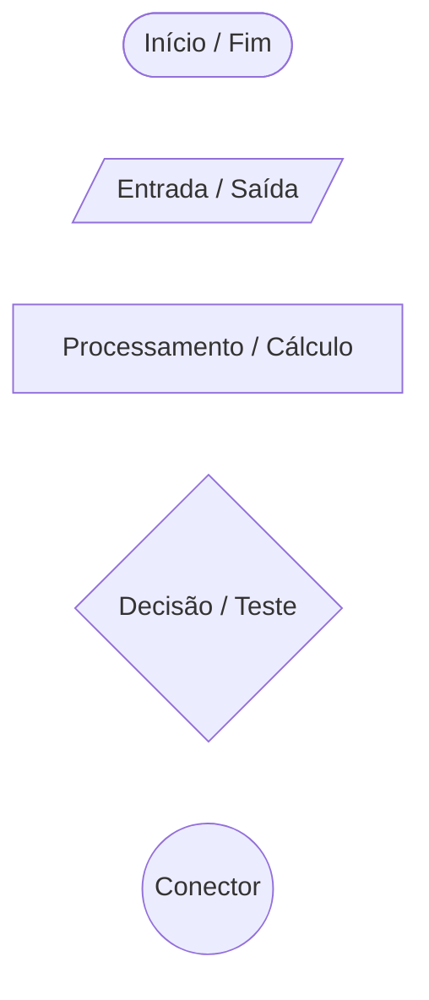
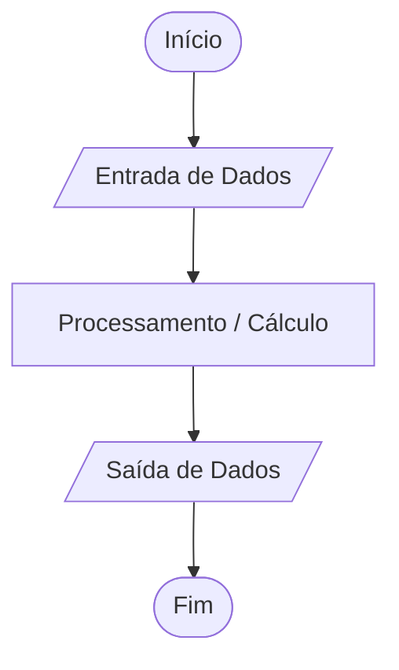
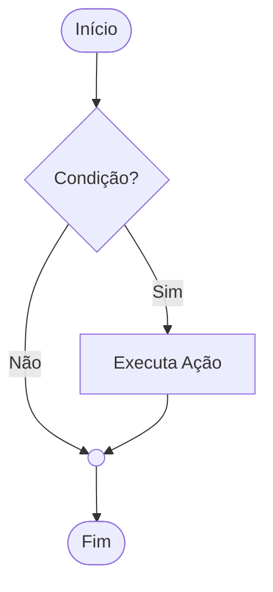
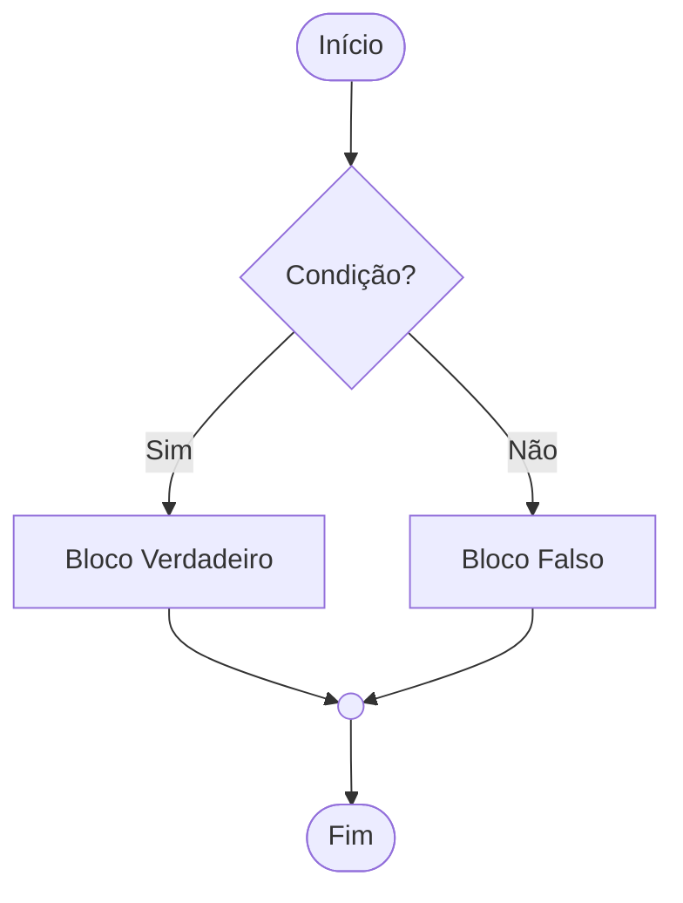
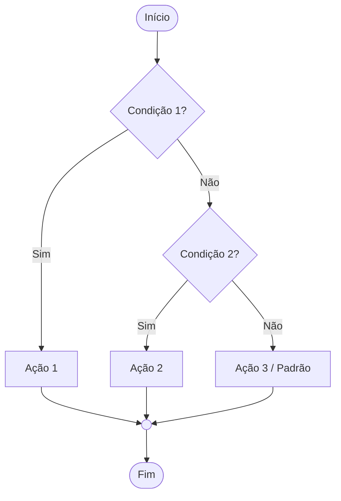
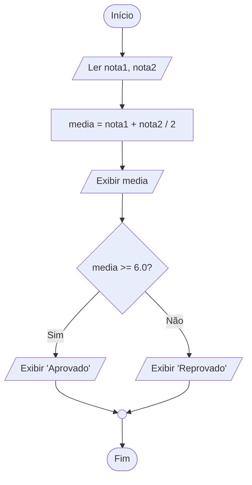
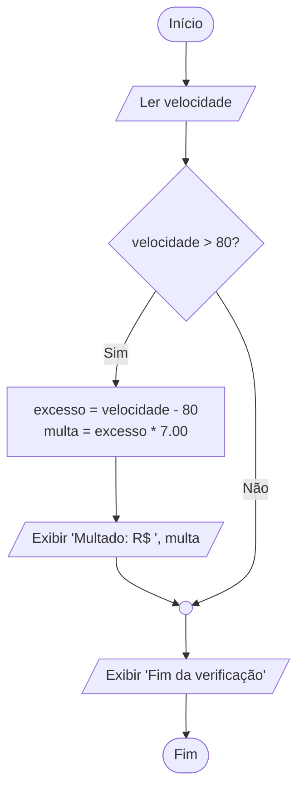
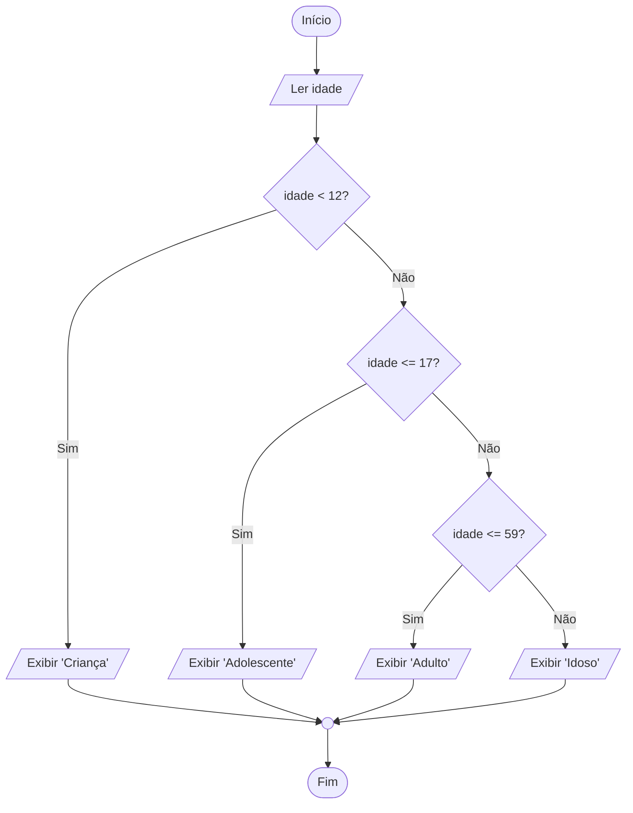

# APOSTILA DIDÁTICA: INTRODUÇÃO AOS FLUXOGRAMAS
**Disciplina:** Lógica de Programação  
**Tópico:** Representação Gráfica de Algoritmos (Estruturas Sequenciais e de Decisão)

**Professor:** Maromo
**Data:** 26/08/2026

---

## 1. Introdução

Na construção de algoritmos, antes da implementação em uma linguagem de programação específica (como C, Java ou Python), é essencial estruturar o raciocínio lógico de forma independente da sintaxe.

Um **fluxograma** é uma representação gráfica e padronizada de um algoritmo. Ele utiliza figuras geométricas convencionadas para indicar as ações, o fluxo de dados e os caminhos de tomada de decisão.

### Vantagens do uso de fluxogramas:
- **Visualização clara do fluxo:** Facilita o rastreamento dos caminhos possíveis de execução.
- **Identificação de desvios e erros:** Torna evidentes ramificações incompletas ou condições lógicas ambíguas.
- **Independência de linguagem:** Foca exclusivamente na lógica do problema.

---

## 2. Simbologia Padrão (Norma ANSI/ISO)

Os principais símbolos utilizados na modelagem de algoritmos sequenciais e condicionais são:

| Símbolo Gráfico | Nome do Bloco | Função / Descrição | Exemplo de Aplicação |
| :--- | :--- | :--- | :--- |
| **Terminal (Elipse / Oval)** | Início / Fim | Delimita o ponto de partida e o encerramento do algoritmo. | `Início`, `Fim` |
| **Paralelogramo** | Entrada / Saída de Dados | Representa a leitura de dados externos ou a exibição de resultados. | `Ler nota1, nota2`<br>`Exibir "Aprovado"` |
| **Retângulo** | Processamento / Atribuição | Representa cálculos matemáticos, operações aritméticas e atribuição de valores a variáveis. | `media = (n1 + n2) / 2`<br>`salario = horas * valor` |
| **Losango** | Decisão / Condição | Avalia uma expressão lógica (relacional ou booleana). Possui obrigatoriamente duas ou mais saídas rotuladas (ex.: Sim/Não, V/F). | `media >= 6.0?`<br>`idade >= 18?` |
| **Linhas com Setas** | Linha de Fluxo | Conecta os blocos e indica a direção e o sentido de execução dos passos. | $\downarrow$ $\rightarrow$ |
| **Círculo Pequeno** | Conector | Une fluxos divergentes ou conecta partes do diagrama em um mesmo ponto para manter a organização. | Ponto de junção após ramificações |

### Representação Visual dos Blocos Individuais



---

## 3. Estruturas Lógicas Fundamentais

### 3.1. Estrutura Sequencial
As instruções são executadas linearmente, de cima para baixo, sem desvios ou ramificações.



---

### 3.2. Estrutura de Decisão Simples (`Se... Então`)
Executa um bloco específico de ações apenas quando a condição testada for **Verdadeira**. Se for Falsa, o fluxo segue diretamente para o próximo passo sem executar ação extra.



---

### 3.3. Estrutura de Decisão Composta (`Se... Então... Senão`)
Define dois caminhos mutuamente exclusivos: um bloco de ações para condição **Verdadeira** e outro para condição **Falsa**.



---

### 3.4. Estrutura de Decisão Encadeada / Aninhada
Utilizada quando há mais de duas alternativas possíveis, encadeando testes sucessivos.



---

## 4. Exemplos Práticos Resolvidos

---

### Exemplo 1: Cálculo de Média e Situação Escolar (Decisão Composta)
**Problema:** Leia duas notas bimestrais de um aluno, calcule a média aritmética simples e informe se o aluno foi **Aprovado** (média $\ge 6.0$) ou **Reprovado** (média $< 6.0$).

#### Pseudocódigo (Portugol)
```text
Algoritmo MediaEscolar
Var
    nota1, nota2, media : Real
Início
    Escreva("Digite a primeira nota: ")
    Leia(nota1)
    Escreva("Digite a segunda nota: ")
    Leia(nota2)
    
    media <- (nota1 + nota2) / 2
    Escreva("Média obtida: ", media)
    
    Se (media >= 6.0) Então
        Escreva("Situação: Aprovado")
    Senão
        Escreva("Situação: Reprovado")
    FimSe
Fim
```

#### Fluxograma



---

### Exemplo 2: Verificação de Multa por Velocidade (Decisão Simples)
**Problema:** Leia a velocidade registrada de um veículo em uma via onde o limite é de 80 km/h. Se a velocidade for superior a 80 km/h, calcule e exiba o valor da multa (sendo R$ 7,00 por cada km/h acima do limite). Ao final, sempre exiba uma mensagem de encerramento.

#### Pseudocódigo (Portugol)
```text
Algoritmo RadarVelocidade
Var
    velocidade, excesso, multa : Real
Início
    Escreva("Informe a velocidade do veículo (km/h): ")
    Leia(velocidade)
    
    Se (velocidade > 80) Então
        excesso <- velocidade - 80
        multa <- excesso * 7.00
        Escreva("Veículo multado! Valor da multa: R$ ", multa)
    FimSe
    
    Escreva("Fim da verificação de trânsito.")
Fim
```

#### Fluxograma



---

### Exemplo 3: Classificação de Faixa Etária (Decisão Encadeada)
**Problema:** Leia a idade de uma pessoa e classifique-a de acordo com as seguintes faixas:
- Menor que 12 anos: **Criança**
- De 12 a 17 anos: **Adolescente**
- De 18 a 59 anos: **Adulto**
- 60 anos ou mais: **Idoso**

#### Pseudocódigo (Portugol)
```text
Algoritmo ClassificaIdade
Var
    idade : Inteiro
Início
    Escreva("Digite a idade: ")
    Leia(idade)
    
    Se (idade < 12) Então
        Escreva("Classificação: Criança")
    Senão
        Se (idade <= 17) Então
            Escreva("Classificação: Adolescente")
        Senão
            Se (idade <= 59) Então
                Escreva("Classificação: Adulto")
            Senão
                Escreva("Classificação: Idoso")
            FimSe
        FimSe
    FimSe
Fim
```

#### Fluxograma



---

## 5. Lista de Exercícios Propostos

> **Restrição:** Todos os exercícios abaixo devem ser resolvidos exclusivamente com operações sequenciais e estruturas de decisão (Simples, Composta ou Encadeada). Não utilize estruturas de repetição (*loops*).

### Exercício 1 (Sequencial)
Desenvolva o fluxograma para um programa que leia o valor total de uma conta em um restaurante, calcule a taxa de serviço (10%) e exiba:
1. O valor da taxa de serviço;
2. O valor total final a ser pago.

---

### Exercício 2 (Decisão Simples)
Uma loja concede um desconto promocional de 15% apenas para compras cujo valor total seja superior a R$ 200,00. Construa um fluxograma que leia o valor da compra, aplique o desconto quando devido e apresente o valor final a pagar.

---

### Exercício 3 (Decisão Composta)
Construa um fluxograma que receba um número inteiro qualquer e determine se ele é **Par** ou **Ímpar** (Dica: utilize a operação de resto da divisão inteira: `numero % 2 == 0`).

---

### Exercício 4 (Decisão Composta)
Elabore um fluxograma que leia dois números distintos ($A$ e $B$) e determine qual deles é o **Maior**, exibindo o resultado formatado.

---

### Exercício 5 (Decisão Encadeada)
Crie um fluxograma para calcular o Índice de Massa Corporal ($\text{IMC} = \frac{\text{peso}}{\text{altura}^2}$) e exibir a classificação do indivíduo:
- $\text{IMC} < 18.5$: **Abaixo do peso**
- $18.5 \le \text{IMC} < 25.0$: **Peso ideal**
- $25.0 \le \text{IMC} < 30.0$: **Sobrepeso**
- $\text{IMC} \ge 30.0$: **Obesidade**

---

### Exercício 6 (Decisão Encadeada)
Uma empresa aplicará um reajuste salarial escalonado aos seus funcionários com base na tabela abaixo:

| Faixa Salarial Atual | Percentual de Reajuste |
| :--- | :--- |
| Até R$ 2.000,00 | 15% |
| De R$ 2.000,01 até R$ 5.000,00 | 10% |
| Acima de R$ 5.000,00 | 5% |

Construa um fluxograma que leia o salário atual, calcule o valor do aumento, o novo salário e exiba ambos.

---

## 6. Gabarito Resumido (Lógica das Decisões)

- **Ex. 1:** `taxa = conta * 0.10` $\rightarrow$ `total = conta + taxa`.
- **Ex. 2:** Teste `valor > 200`. Se Sim: `valor_final = valor * 0.85`; Se Não: `valor_final = valor`.
- **Ex. 3:** Teste `numero % 2 == 0`. Se Sim $\rightarrow$ "Par"; Se Não $\rightarrow$ "Ímpar".
- **Ex. 4:** Teste `A > B`. Se Sim $\rightarrow$ "Maior é A"; Se Não $\rightarrow$ "Maior é B".
- **Ex. 5:** Sequência de testes encadeados sobre a variável `imc`: `imc < 18.5`, depois `imc < 25.0`, depois `imc < 30.0`, e no falso do último, "Obesidade".
- **Ex. 6:** Teste `salario <= 2000` (15%). Se Não, testa `salario <= 5000` (10%). Se Não, aplica 5%. Ao final: `novo_salario = salario + aumento`.
